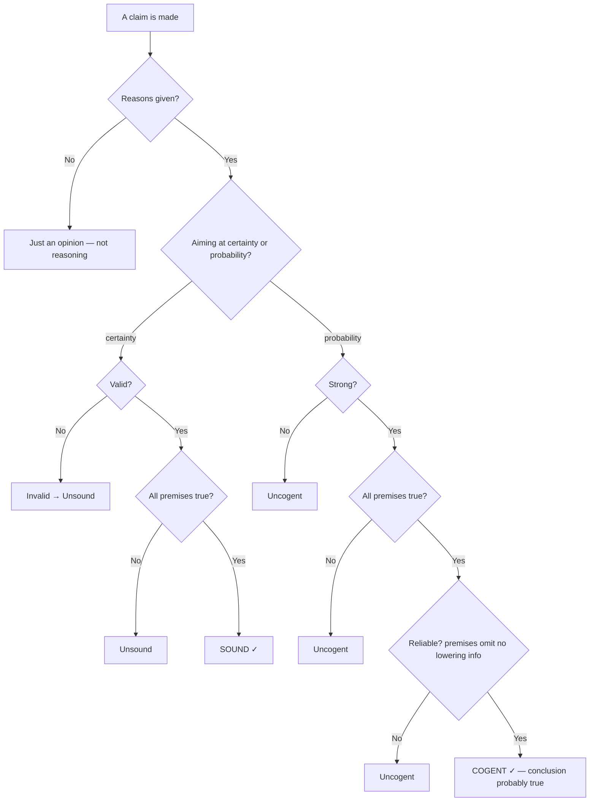

Basic Concepts of Reasoning

The vocabulary the whole course is built on — argument, inference, and the two ways an argument can be good

1

Statement?

has a truth value (T/F)

→

2

Argument?

reasons → conclusion via an inference

→

3

Deduction or induction?

certainty vs probability

→

4

Good?

true premises + acceptable inference

★<h2>The one idea to hold onto</h2>two independent questions

Are the premises true?
A question about the <b>world</b> — answered by evidence, research, testimony, definitions.

Is the inference acceptable?
A question about the <b>link</b> — would the premises, <i>if</i> true, support the conclusion? Answered without checking whether they're actually true.

These two are <b>entirely independent</b>. An argument can have false premises + a perfect inference, or true premises + a broken inference. Never let one answer stand in for the other — this separation is the spine of the entire book.

# Ch1 — Basic Concepts of Reasoning

> [[critical-thinking-in-real-world/index|← Critical Thinking in Real World]] · Textbook Ch.1. Sets up every term used later. Companion exercises: **1.1–1.7** (answers held privately for feedback — solve them and send your work).

---

## Reasoning, argument, explanation

- **Reasoning** = giving a reason (or reasons) for a claim. A bare opinion ("Vegetables are good for you") is *not* reasoning — no reason is offered.
- Two uses of reasoning: **argumentation / justification** (persuade you a claim is *true*) and **explanation** (tell you *why* an already-accepted fact is true — "the Titanic sank *because* it hit an iceberg"). In ordinary language the two blur; the book treats explanations largely as arguments.
- **Argument from Best Explanation** — a special form: of the rival explanations of some facts, infer the one with the most **explanatory power** (explains the most, fits your background info best). *E.g.* open door + missing TV/DVD/jewellery → "burgled" beats "wife lent the TV out."

## Statements vs non-statements

A **statement** is a sentence capable of being **true or false** (it has a *truth value*) — even if you don't know which.

- **Test:** slot it into *"It is true that ___."* If the result is grammatical, it's a statement. ("It is true that Belfast is the capital of England" — grammatical, so it's a statement, just a false one. "It is true that what time is it?" — nonsense, so not a statement.)
- **Not statements:** requests, questions, orders/commands, declarations, suggestions — they can't be reasons or conclusions.
- **Watch two cases:** a **rhetorical question** *does* express a statement ("Who wants to be alone?" ⇒ "Nobody wants to be alone"); and a **complex sentence** ("It is hot in Qatar and cold in Finland") packs two statements.

## Argument = reasons + conclusion + inference

Three parts:

| Part | What it is |
|---|---|
| **Reason(s) / premise(s)** | the statements offered *in support* |
| **Conclusion** | the statement the arguer wants you to accept |
| **Inference** | the *process* of drawing the conclusion from the reasons — **not a statement**, so it has no truth value |

Not every set of statements is an argument — a list of facts about Plato with no supporting intent is merely **descriptive**.

## Spotting the structure

- **Inference indicators** flag the move: **conclusion indicators** (*therefore, so, hence, thus, consequently, which shows that*) precede the conclusion; **reason/premise indicators** (*because, since, for, as, given that*) precede a premise.
- **Indicators are context-sensitive** — "since" and "as" often mark *time*, not inference ("*Since* Man Utd entered the league…"). Read the meaning, not the word.
- **Reading between the lines** — indicators are often absent. Test: could you insert *"so"* or *"because"* between the two statements and keep the sense? Then an inference is present.

## The Principle of Charity (the master heuristic)

> If there is more than one way to read an argument, **read it in the way that makes it the best argument — while not putting unintended words in the arguer's mouth.**

Uses:
- **Missing conclusion** — left implicit (common in ads: "The bigger the burger the better, and Big Boy's are biggest" ⇒ *[Big Boy's are best]*). Make your own conclusions explicit.
- **Missing premise** — supply it when (a) the arguer *needs* it and (b) the arguer would *agree* with it. An uncontroversial gap ("cats are animals") is fine to fill silently; a **controversial** hidden premise (e.g. an offensive assumption smuggled into a conclusion) should be **dragged into the open** so it can be challenged.

## Conditionals and disjunctions are single claims

- An **"If P then Q"** statement is **one statement, not an argument** — it asserts neither P nor Q, only the link. ("If" is *never* an inference indicator; "since" is.)
- A conditional can be a premise or a conclusion *inside* an argument, but must **never be split**.
- **"Either P or Q"** (a *disjunction*) is likewise one claim.

## Basic vs complex arguments

- **Basic reason** — a premise not itself supported by any further reason.
- **Complex argument** — contains an **intermediate conclusion**: a statement that is *both* supported by reasons *and* itself supports the final conclusion. Chains of these build long arguments (developed in [[ctrw-ch02-diagramming-reasoning|Ch2]]).

## Deduction vs induction — the core split

The arguer's **intention** decides which it is (aiming at certainty = deductive; aiming at probability = inductive). Keep the two vocabularies strictly apart:

| | **Deductive** (aims at certainty) | **Inductive** (aims at probability) |
|---|---|---|
| Good inference | **valid** — *if* premises true, conclusion **must** be true (all-or-nothing) | **strong** — *if* premises true, conclusion **very likely** (comes in degrees) |
| Gold standard | **sound** = valid **and** all premises actually true | **cogent** = all premises true **and** at least moderately strong **and** reliable |
| Vocabulary | valid/invalid · sound/unsound | weak / moderately strong / strong · reliable/unreliable · cogent/uncogent |

- **Validity** is about *structure*, not truth: it can come from **content** ("red car → car") or **form** ("All As are Bs; all Bs are Cs; so all As are Cs"). A valid argument can have any mix of true/false premises — the one combination it can *never* have is **true premises + a false conclusion**.
- **Counterexamples show invalidity:** an *informal* one imagines a scenario with the premises true and the conclusion false; a *formal* one builds a same-form argument with obviously true premises and an obviously false conclusion. (You can't prove validity by examples — that needs [[ctrw-ch05-forms-of-argument|Ch5]]/[[ctrw-ch08-categorical-logic|Ch8]] methods.)
- **Strength degrees:** *weak* = conclusion **not more likely true than false**; *moderately strong* = more likely than not, but not very likely; *strong* = very likely but short of certain.
- **Conjecture** — a special inductive case where the arguer accumulates evidence *without* intending the argument to be strong yet (signalled by "perhaps," "maybe").
- **Reliability / cogency** — probability is *always relative to total information*. An inference is **unreliable** if the premises omit extra info you have that would **lower** the conclusion's likelihood (the salty-gherkin that you happen to know was soaked in *syrup*). Cogency requires the premises not to hide such info.

## Acceptability, made precise

The seminar sharpens "good argument" into three exact conditions — one per part of the argument:

| Part | Acceptable **iff** | Nature |
|---|---|---|
| **Premise** | it is **true** | **binary** — a premise is acceptable or not, never both |
| **Inference** | it is **(relatively) strong** | **comes in degrees** — more or less acceptable |
| **Conclusion** | it has been **established** | the *output* of the two above |

- The chain: an **established conclusion** needs a **good argument** (acceptable inference **+** acceptable premises), and premise-acceptability is **independent** of inference-acceptability — the two are checked separately (the *two independent questions* from the summary block above).
- **Acceptability ≠ truth.** If a conclusion *is* established, it is either **guaranteed** (deductive) or **highly likely** (inductive) to be actually true. But if a conclusion is **un**established, that tells you nothing about the world — it may *still* happen to be actually true or actually false. A bad argument for a true conclusion is still a bad argument.

> [!info] The class mnemonic — "die die" vs "got chance"
> Deductive = the arguer wants the conclusion accepted as **guaranteed** ("*die die* must be accepted"). Inductive = accepted as **highly likely** ("*got chance* can be accepted"). Both intend **true premises**; the *only* difference is the intended **strength of the inference**.

> [!warning] Validity belongs to inferences, not statements
> There is **no such thing as a "valid statement" or a "valid question."** *Valid* / *invalid* describe an **inference** (and, by extension, a deductive argument) — never a single claim, and never truth. A statement is true or false; only the *link* between statements can be valid.

## Putting it together — the good-argument decision tree

When no indicators and no clear form tell you which mode it is, **the Principle of Charity decides**: read it as whichever mode makes it the better argument (good deduction > good induction > bad deduction).

## Deduction vs induction — which is "better"?

- Deduction wins two ways: a valid inference supports its conclusion better than even a strong inductive one, and sound arguments give *true* conclusions vs merely *probable* ones.
- But induction is indispensable: it **expands knowledge** (generalising "all metals expand when heated" from cases), whereas a deduction's conclusion is already contained in its premises. And where genuine uncertainty rules (disaster-relief triage), forcing deductive "certainty" is the wrong tool.

> [!example] What good is a *sound* argument? — it tells you nothing new
> *"Tharman got the most votes in the election; whoever gets the most votes wins; so Tharman won."* This is **sound** (valid + true premises), yet the conclusion is already **buried in the premises** — "got the most votes" just *is* winning. A sound deduction re-describes what you already granted; it never adds a fact about the world.
> Contrast: *"Tharman got 70% of the votes; so Pritam voted for Tharman."* This is **not** sound and not even valid — but if strong it would be **cogent**, and it genuinely reaches *beyond* the premise to a new claim. That is the standing trade-off: **deduction = certain but non-ampliative; induction = ampliative but uncertain.**

## Key takeaways

- **Truth of premises ⟂ acceptability of inference** — always two separate checks.
- **Validity/soundness** belong to deduction; **strength/reliability/cogency** to induction — never mix the words.
- **Validity is all-or-nothing and about form/content, not actual truth**; strength has degrees.
- **The Principle of Charity** governs every gap: missing premises, missing conclusions, and deciding deduction vs induction.

## Related notes

- [[ctrw-ch02-diagramming-reasoning]] — draw the reason→conclusion structure this chapter names
- [[ctrw-ch03-evaluating-arguments]] — how to *judge* truth and the degree of support
- [[ctrw-ch05-forms-of-argument]] — the reliable tests for validity this chapter defers
- [[case-drug-legalisation-grayling]] — a real op-ed dissected with exactly these tools
