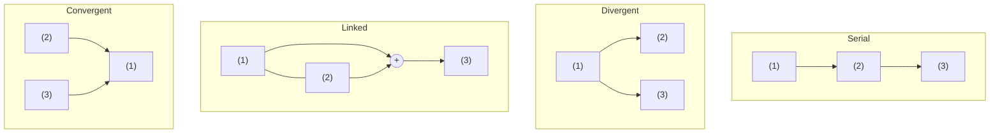

Diagramming Reasoning

Draw the structure before you judge it — understand <i>how</i> an argument is meant to work first

1

Number

each statement in reading order

→

2

Fill gaps

add missing [indicators] in brackets

→

3

Pattern

serial · divergent · linked · convergent

→

4

Draw

arrows down, conclusion at the bottom

★<h2>Why diagram at all</h2>clarify, then evaluate

Diagram ≠ text order
The <b>numbering</b> follows the words; the <b>diagram</b> follows the logic. The final conclusion always sits at the <b>bottom</b>, even if it was stated first.

Not mechanical
You can't read the shape straight off the indicator words — interpretation and the Principle of Charity decide which reason feeds which conclusion.

Deciding a pattern already begins <b>evaluation</b> (see [[ctrw-ch03-evaluating-arguments|Ch3]]): to call reasons "linked" is to judge that neither supports the conclusion alone.

# Ch2 — Diagramming Reasoning

> [[index|← Critical Thinking in Real World]] · Textbook Ch.2. Builds the argument-map you evaluate in Ch3. Exercises **2.1–2.4** (private answer key held for feedback).

---

## The diagramming method (the mechanics)

1. **Number every statement** `(1) (2) (3)…` in the order it appears in the text; a statement repeated later keeps its **first number**.
2. Words/phrases can stand in for statements (e.g. "cheap, nutritious, tasty" = three separate reasons).
3. **Add missing inference indicators** in `[square brackets]` to make the reasoning explicit.
4. A **conditional** ("If P then Q") and a **disjunction** ("Either P or Q") are each **one** numbered statement — never split.
5. Draw arrows from reason(s) down to conclusion; the **final conclusion is always at the bottom** of the diagram regardless of where it appeared in the text.

### Three roles — read them straight off the arrows
Once the diagram is drawn, every statement is exactly one of three kinds, and the **arrow direction alone** tells you which:

| Role | Arrow test |
|---|---|
| **Final conclusion (FC)** | arrows only go **in** — nothing leads out of it |
| **Intermediate conclusion (IC)** | arrows go **in *and* out** — it is supported, and it in turn supports |
| **Unsupported / basic premise (UP)** | arrows only go **out** — nothing supports it |

## The four patterns — every argument is built from these

| Pattern | Idea | Shape | Key test |
|---|---|---|---|
| **Serial** | one reason → a conclusion, which may itself be a reason for the next | `(1)→(2)→(3)` a chain | are there **intermediate conclusions** (both supported *and* supporting)? |
| **Divergent** | **one** reason → **several** conclusions | `(2)←(1)→(3)` | is a single claim used to draw *multiple* implications? |
| **Linked** | two+ reasons that **need each other** | `(1)+(2) → (3)` | remove one → the rest **lose their power**. Conditionals & disjunctions almost always link with their partner premise |
| **Convergent** | two+ reasons each supporting **independently** | `(2)→(1)←(3)` separate arrows | does each reason stand **on its own**? Do they give *different lines* of support? |

## Linked vs convergent — the hard distinction

This is the judgement the chapter drills hardest:

- **Linked** = the reasons work as a *package*; each is offered as **dependent** on the others. Test: *does each reason need the others to support the conclusion?* If yes → linked. Conditional (`If P then Q`) + its trigger (`P`) is the classic linked pair — neither alone gets you to `Q`.
- **Convergent** = each reason is **robust on its own**; they are separate mini-arguments aimed at the same conclusion, often drawing on *different kinds* of content. If one turned out false, the others still support the conclusion.
- **Deductive default:** by charity, read a valid argument's multiple premises as **linked** (that's what makes it valid). One good linked argument beats splitting it into two weak convergent ones.
- **Cumulative case** (the grey zone): reasons about a *whole person or situation* ("she's fun, beautiful, clever, kind → ask her out") may be intended as one accumulating **package**. Signalled by *cumulative case indicators* — "what's more," "to add to that," "if that's not enough." But indicators are context-sensitive (as in [[ctrw-ch01-basic-concepts-of-reasoning|Ch1]]); judge the arguer's intent, not the word.

## Putting it all together

Real arguments **combine all four patterns** in one diagram. Method: **work backwards from the conclusion(s)**, ask which reasons feed which, and let the shape emerge. A single passage can have a serial spine, a linked pair feeding one node, and divergent conclusions branching off the top.

> Interpreting long arguments this way is the payoff of the whole chapter — and the input to evaluation in Ch3.

## Key takeaways

- **Number by text order; draw by logic** — conclusion at the bottom.
- Master the **four patterns**; most difficulty is **linked vs convergent** → ask "does each reason *need* the others?"
- Conditionals and disjunctions are **single statements** and tend to force linked reasoning.
- **Diagramming is interpretation**, not mechanics — the Principle of Charity picks the structure; choosing "linked" already starts evaluating.

## Related notes

- [[ctrw-ch01-basic-concepts-of-reasoning]] — statements, inference indicators, basic vs complex arguments (the inputs to a diagram)
- [[ctrw-ch03-evaluating-arguments]] — now judge the diagram: are the reasons true, and do they support the conclusion?
- [[ctrw-ch04-diagramming-reasons-for-and-against]] — extend diagrams to objections and rebuttals
- [[case-drug-legalisation-grayling]] — a real op-ed reconstructed as premises → conclusion
