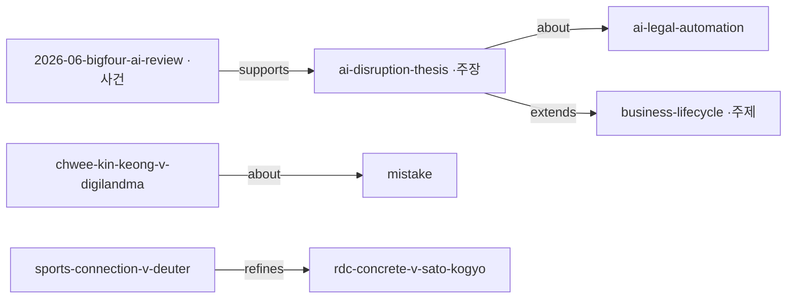
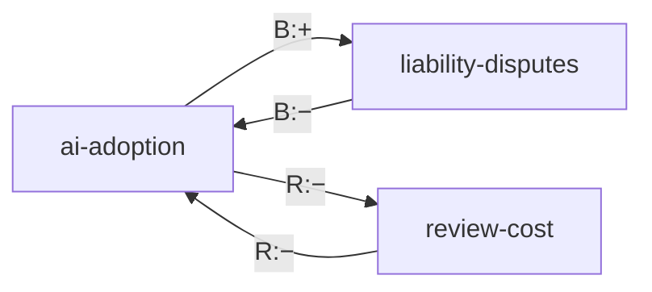
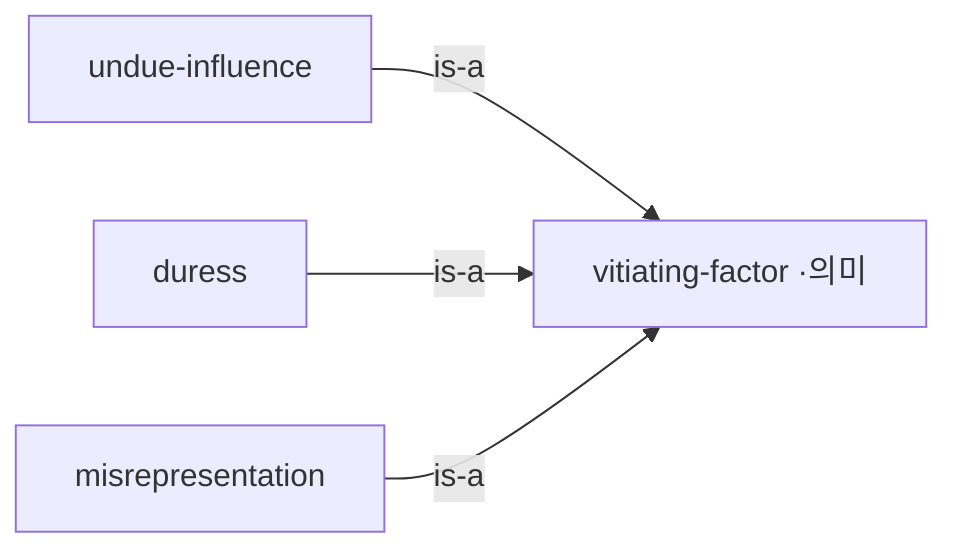

# 그래프 시각화 (초점 뷰)

*2026-07-03 생성 · 전체 인터랙티브: `graph/graph.html`*

## 🗣️ 담론 그래프 (논증 구조)

```mermaid
flowchart LR
  n_signals_2026_06_bigfour_ai_review["2026-06-bigfour-ai-review ·사건"]
  n_cross_domain_ai_disruption_thesis["ai-disruption-thesis ·주장"]
  n_cases_chwee_kin_keong_v_digilandmall["chwee-kin-keong-v-digilandma"]
  n_law_concepts_ch12_mistake_mistake["mistake"]
  n_cases_sports_connection_v_deuter["sports-connection-v-deuter"]
  n_cases_rdc_concrete_v_sato_kogyo["rdc-concrete-v-sato-kogyo"]
  n_drivers_ai_legal_automation["ai-legal-automation"]
  n_cross_domain_business_lifecycle["business-lifecycle ·주제"]
  n_signals_2026_06_bigfour_ai_review -->|supports| n_cross_domain_ai_disruption_thesis
  n_cases_chwee_kin_keong_v_digilandmall -->|about| n_law_concepts_ch12_mistake_mistake
  n_cases_sports_connection_v_deuter -->|refines| n_cases_rdc_concrete_v_sato_kogyo
  n_cross_domain_ai_disruption_thesis -->|about| n_drivers_ai_legal_automation
  n_cross_domain_ai_disruption_thesis -->|extends| n_cross_domain_business_lifecycle
```

---

## 🔄 피드백 루프 (CLD)

```mermaid
flowchart LR
  n_systems_ai_adoption["ai-adoption"]
  n_systems_liability_disputes["liability-disputes"]
  n_systems_review_cost["review-cost"]
  n_systems_ai_adoption -->|B:+| n_systems_liability_disputes
  n_systems_liability_disputes -->|B:−| n_systems_ai_adoption
  n_systems_ai_adoption -->|R:−| n_systems_review_cost
  n_systems_review_cost -->|R:−| n_systems_ai_adoption
```

---

## 🌳 is-a 포섭 계층

```mermaid
flowchart LR
  n_law_concepts_ch14_duress_undue_influence_undue_influence["undue-influence"]
  n_law_concepts_vitiating_factor["vitiating-factor ·의미"]
  n_law_concepts_ch14_duress_undue_influence_duress["duress"]
  n_law_concepts_ch13_misrepresentation_misrepresentation["misrepresentation"]
  n_law_concepts_ch14_duress_undue_influence_undue_influence -->|is-a| n_law_concepts_vitiating_factor
  n_law_concepts_ch14_duress_undue_influence_duress -->|is-a| n_law_concepts_vitiating_factor
  n_law_concepts_ch13_misrepresentation_misrepresentation -->|is-a| n_law_concepts_vitiating_factor
```
