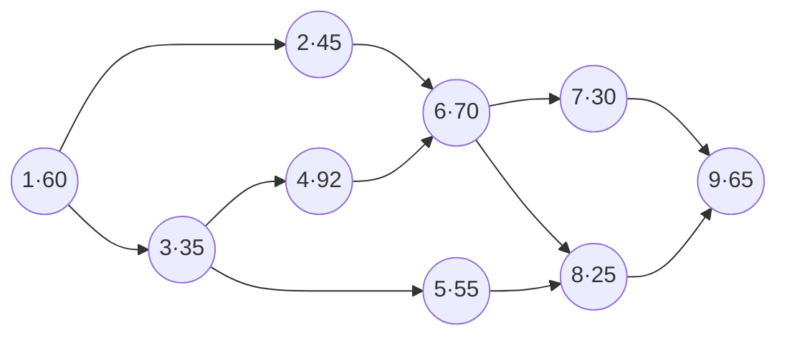

Line Balancing

Spread the tasks across stations so the line hits its target rate with the fewest stations and least idle time

1

Target cycle time

= available time ÷ target output

→

2

Theoretical min stations

Nmin = Σtk ÷ CT (round up)

→

3

Assign by a rule

LTT or LNF, respecting precedence

→

4

Efficiency

= Σtk ÷ (Na × CT)

1<h2>What problem is this?</h2>staffing a line to demand

The setting
A <b>line-flow</b> process (a moving line of identical products). We must place every task into a sequence of workstations.

The goal
Meet the <b>target flow rate</b> with the <b>fewest workstations</b> (highest utilization) and the <b>least idle time</b> — a "good balance".

Two hard constraints: every station's total time ≤ <b>target cycle time</b>, and tasks obey their <b>precedence</b> (a task can only go in once all its predecessors are placed).

2<h2>Two priority heuristics</h2>good, not guaranteed optimal

LTT — Longest Task Time
Among eligible tasks that still fit, assign the one with the <b>longest task time</b> first.

LNF — Largest Number of Followers
Among eligible tasks that still fit, assign the one with the <b>most downstream tasks</b> first.

# Line Balancing — Assigning Tasks to Workstations

> [[operations-management|← Operations Management]] · Previous idea: [[process-analysis]] (the bottleneck limits a process). Line balancing is how we *design* the line so no station becomes a needless bottleneck.

**Line balancing** allocates tasks across workstations to *balance the workload* while meeting the target flow rate. It is the "staffing to demand" half of **production levelling** — setting a steady target output rate for a period so planning stays tractable and production stays consistent. Levers include automating/outsourcing slow tasks, adding workers or overtime, and **specialisation** (breaking down the bottleneck task). Because target demand shifts across periods, **capacity flexibility** — cross-training and a temporary/flexible workforce — matters for the long run.

---

## Vocabulary

| Term | Meaning |
|---|---|
| **(Target) cycle time, CT** | Time between successive finished units coming off the end of the line. Set by demand: $CT = \dfrac{\text{available time}}{\text{target output}}$ |
| **Task time, $t_k$** | Time to complete task $k$ |
| **Eligible task** | A task all of whose predecessors are already placed in the current or an earlier station |
| **Efficiency** | $\dfrac{\sum t_k}{N_a \times CT}$ — the line's average utilization ($N_a$ = actual # stations) |
| **Theoretical min stations** | $N_{\min} = \left\lceil \dfrac{\sum t_k}{CT} \right\rceil$ — you can never do better than this |

> [!note] Efficiency is a utilization
> $\sum t_k$ is the real work (busy time); $N_a \times CT$ is the time made available. Their ratio is exactly "what gets done ÷ what could get done" — the same utilization idea as in [[process-analysis]].

---

## Worked example — Huffy bicycles

Huffy runs one 8-hour shift/day; daily production plan = **225** bicycles. Nine tasks (total 477 s):

| Task | 1 | 2 | 3 | 4 | 5 | 6 | 7 | 8 | 9 |
|---|---|---|---|---|---|---|---|---|---|
| Time (s) | 60 | 45 | 35 | 92 | 55 | 70 | 30 | 25 | 65 |
| Predecessors | — | 1 | 1 | 3 | 3 | 2,4 | 6 | 5,6 | 7,8 |

**Step 1 — target cycle time.** Available time = 8 × 3600 = 28 800 s/day. $CT = 28\,800 / 225 = \textbf{128 s}$.

**Step 2 — theoretical minimum.** $N_{\min} = \lceil 477 / 128 \rceil = \lceil 3.73 \rceil = \textbf{4}$ stations. *You cannot do better than 4.*

**Step 3 — assign with LTT.** Open a station, list eligible tasks, assign the longest one that still fits (task time + station time ≤ 128); when nothing fits, open the next station.

| Station | Time remaining | Assigned | Idle |
|---|---|---|---|
| 1 | 128 → 68 → 23 | **1, 2** | 23 |
| 2 | 128 → 93 → 1 | **3, 4** | 1 |
| 3 | 128 → 58 → 3 | **6, 5** | 3 |
| 4 | 128 → 98 → 73 → 8 | **7, 8, 9** | 8 |

Total idle = 23 + 1 + 3 + 8 = **35 s**, using **4 stations** = $N_{\min}$ → this balance is **optimal**.

**Step 4 — efficiency.** $\dfrac{477}{4 \times 128} = \dfrac{477}{512} = \textbf{93.2\%}$ average utilization.

> [!tip] LTT beat LNF here
> The same problem under **LNF** needs **5 stations**, so efficiency drops to $477/(5\times128) = \textbf{74.5\%}$. Both are heuristics — neither is guaranteed optimal — but a solution that reaches $N_{\min}$ *is* optimal. When a priority rule ties, break the tie with the other rule.

---

## The general procedure (any priority rule)

1. Open a new station $k$ with station time 0.
2. List all **eligible** tasks. If none exist, stop — final CT = largest station time, # stations = $k$.
3. Pick the first eligible task by the priority rule. If (task time + current station time) ≤ CT, assign it (step 5); else ignore it (step 4).
4. Ignore that task; if more eligible tasks remain, return to step 3, otherwise open a new station (back to step 1).
5. Add the task to the station, increase station time, refresh the eligible list, return to step 2.

---

## Two more results

**Maximum production rate.** A station can never be shorter than its single largest task, so the *minimum* possible cycle time equals the **longest task time** — here task 4 = 92 s. Max production ≈ $28\,800 / 92 ≈ \textbf{313 units/day}$. Note **target production (225) need not equal maximum production (313)** — you balance to the target, not the max.

**Why the optimum can exceed $N_{\min}$.** $N_{\min}$ is a lower bound only; the real optimum may need more stations because task times are **discrete** (they don't divide evenly into CT) and **precedence** forbids some groupings.

**Handling leftover idle time:** give idle workers quality-control or background work, **cross-train** them to help busy stations, or redesign the process.

## Related notes

- [[process-analysis]] — capacity, bottleneck, flow rate, the utilization idea reused here
- [[waiting-line-management]] — when task/arrival times are *variable* rather than fixed
- [[m06-cvp-analysis|MA · CVP]] — the same "available time ÷ rate" arithmetic appears in target-output planning
